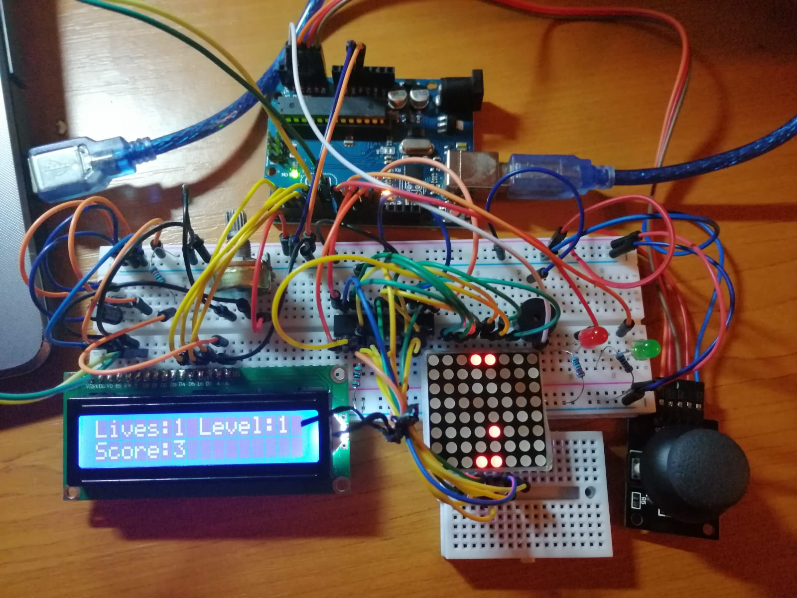

# Pong game

Pong is a two-dimensional sports game that simulates table tennis. The player controls an in-game paddle by moving it horizontaly across the bottom side of the screen. He competes against the AI controlling a second paddle on the opposing side. They both use the paddles to hit a ball back and forth. The goal of the player is to stay in the game as long as possible.

**Hardware**

1. Arduino Uno
1. 1x Breadboard
1. 8x8 Led matrix
1. LCD
1. Joystick
1. Wires
1. Potentiometer
1. MAX7219 Driver
1. Buzzer
1. 2x Leds ( red and greed)

**Photo with the whole circuit**

**Game specifications**

1. Score - The player's score increments with every hit he makes, multiplied by the level coefficient
1. Difficulty - Each game begins with a difficulty value set by the player before starting. Then, the difficulty increases as the player levels up (every 10 seconds) and the speed of the ball increases, too. When the player reaches level 5, new obstacles will appear on the screen and when the ball hits them, it will with bounce back, making it harder for the player.
1. During the game, the LCD will display 3 major info:
   1. Score
   1. Lives
   1. Level
1. Players - The game features only one player.
1. More lives - At random moments of time during the game, a blinking dot will appear on the screen. If the player hits it before the AI does it and while it still appears on the screen( the dot will be avaiable for a short time - 4 seconds), the number of lives increments by 1.
1. Finishing the game - when the player has no more lives, the game is finished.
1. Highscore - Everytime the game is finshed, if the score is bigger than the current highscore, the player's name and his score will be stored in the EEPROM

**HOW TO PLAY**

1. When powering up the Arduino, a "Welcome" message will be displayed on the matrix and also another one on the LCD.
1. After the message is gone, you are in the Main Menu. A new "START GAME" message will be displayed on the matrix, as long as you are navigating in the Main Menu. Here, you can navigate between the options by moving the joystick on the OX axis (horizontally), which you can choose by pressing the joystick button or by moving it on the OY axis (vertically). The options are:
   1. Start Game
   1. Highscore
   1. Settings
   1. Info
   
#### Start Game ####

When choosing the "Start Game" option, your game has just begun. The paddles and the ball will be displayed on the 8x8 matrix, with the paddle you are in control on the bottom of it. The level you started is the one you had set up in the "Settings" Menu (otherwise the default value is 1) and also the name you had set up, too ( maximum of 11 characters allowed). The goal of the game is to hit the ball as many times as possible, as your score gets incremented by the current level value everytime the ball hits your paddle.

#### Moving the paddle ####

As long as you the round is not over, you can move your paddle by moving the joystick on the OX axis (horizontally).

#### Hitting the ball ####

When the ball reaches the second line on the matrix, you have to hit the ball so you don't lose the round. If you managed to hit it, the green led lights up

#### Difficulty #####

The game's difficulty increases as long as you play. As you reached certain levels (5, 10, 13 or 16), the ball's speed increases, the level increments faster, but also the paddle will be moved faster, too.

#### Extra lives ####

At random moments of time (but after level 6, 10 or 14) maximum 3 "extra lives" will be displayed on the matrix, one at each time. From the time it appears on the screen, you have 4 seconds (until it vanishes) to hit it with the ball. If you succeed, the number of lives increases by one. Otherwise, nothing happens.

#### Losing one life ####

If you failed to hit the ball and it reaches the paddle's line, you lost one life. If you had at least 2 lives (and now you remained with only one), the matrix freezes for 5 seconds, the red led lights up and the buzzer will make a sound. After these 5 seconds, another "round" begins.

#### Losing the game ####

If you ran out of lives, the game is over. A message with "GAME OVER" will be displayed on the matrix. If you made a highscore, a "Congratulations, you made a new highscore" message will be displayed on the LCD. After 5 seconds, another message appears asking if you want to exit to the Main Menu, or you want to try again, with the same name and starting level you set up. Otherwise, if you didn't make a new highscore, a "Congratulaions, you made xxxx points" message will be displayed on the LCD. After 5 seconds, another message appears asking if you want to exit or to try again.

#### Highscore ####

In this category, it will be displayed on the LCD the highscore, along with the player's name who made it. To exit, you need to press the joystick button

#### Settings ####

In this category, you can set up the starting level of the game, along with the name. If you don't set up any of them, your game will start with the default values ( level : 1 and name : "AAAAAAAAAAA").  To change the level, you need your cursor to be placed on the "Level" option, to click the joystick, and then increment or decrement it by moving on the OY axis (vertically). When you finish, you need to click again the joystick. To change the player's name, you need to select the "Name" option by clicking on it, to set up every letter (by moving on the OY axis) and to move from one to another, you need to move the joystick on the OX axis (horizontally). After you finished, you have to click the joystick button. To exit, you need to press the joytstick button on the "Exit" option.

#### Info ####

In this category, some info is displayed on the LCD. On the first line, it appears the name of the game and on the second one, the team's name that is holding the "Introduction to Robotics" course, @UnibucRobotics.
